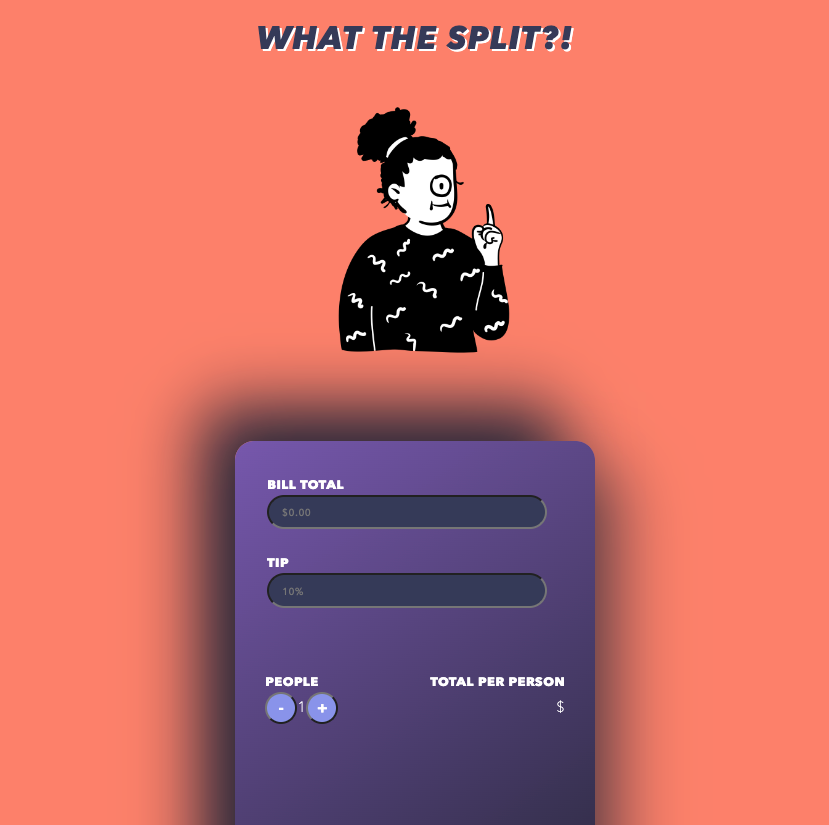

# Tip-Calculator

Site for App: 

https://1dedios.github.io/Tip-Calculator/

## Summary:

A Tip Calculator that shows you what the total pay would be for ANY bill with or without tip. Regardless of how many people you want to split the total with. 

***

## Screenshot of Calculator App:

***

## Table of Contents
***
1. [Success Criteria](#SuccessCriteria)
2. [Dependencies](#Dependencies)
3. [Deployed Page](#DeployedPage)

***

## Success Criteria:

- ✅ To make a calculator app that could calculate any bill total along with a corresponding tip and be split in any number of ways. 🎉  
- ✅ Show off some design skills 🎨 
- Responsive design for mobile. 
    - However, the plus (+) and minus (-) are not centered on my iphone 13  pro max

 

***

## Dependencies:

1. Color Palette - [Color Hunt](https://colorhunt.co/) 🎨
2. Illustrated Image - [Design Stripe](https://designstripe.com/)
3. Sneaker Icons - [Flaticons](https://www.flaticon.com/)
4. Quote Section Image - [Mountain Image](https://www.pexels.com/photo/gray-and-brown-mountain-417173/) 📸
6. Documenation (Organized by date - *not edited*) - [Documentation](https://www.notion.so/dediosprogramming/Tip-Calculator-5db52949642b4b7ab6de7ec888bc92b0) 📝

***

## Deployed Page:

[You can view the landing page here.](https://1dedios.github.io/odin-landing-page/)